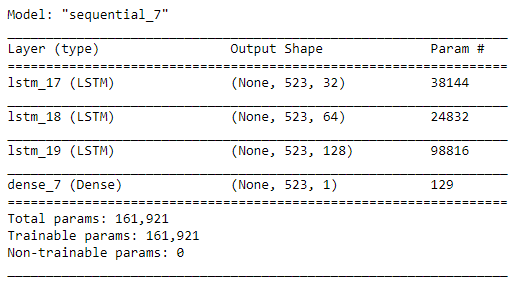

# Modeling-time-series-data-with-RNN
Modelling Electronic Health Records (EHRs) data taken from Pediatric Intensive Care Unit (PICU) at Children's Hospital Los Angeles with RNN

The EHR dataset used here consists of patient data in a Pediatric Intensive Care Unit (PICU) at Children's Hospital Los Angeles. This dataset contains a collection of patient encounters with a set of variables measured or observed at different times during each encounter. It is important to note that time between measurements can vary from minutes to hours. In addition to non-uniform sampling, not all measurements were taken for all patients at each encounter. Measurements include:
* Statics (e.g. gender, age, weight)
* Vitals (e.g. heart rate, respiratory rate)
* Labs (e.g. glucose, creatinine)
* Interventions (e.g. intubation, O2)
* Drugs (e.g. dopamine, epinephrine)

The dataset Consists of 5000 number of patient encounters and measured Timestamps 76693.

Project tasks in [Project_tasks.pdf](Project_tasks.pdf)

Experiment Model and Result.

Full Solution in [Project.ipynb](Project.ipynb)
